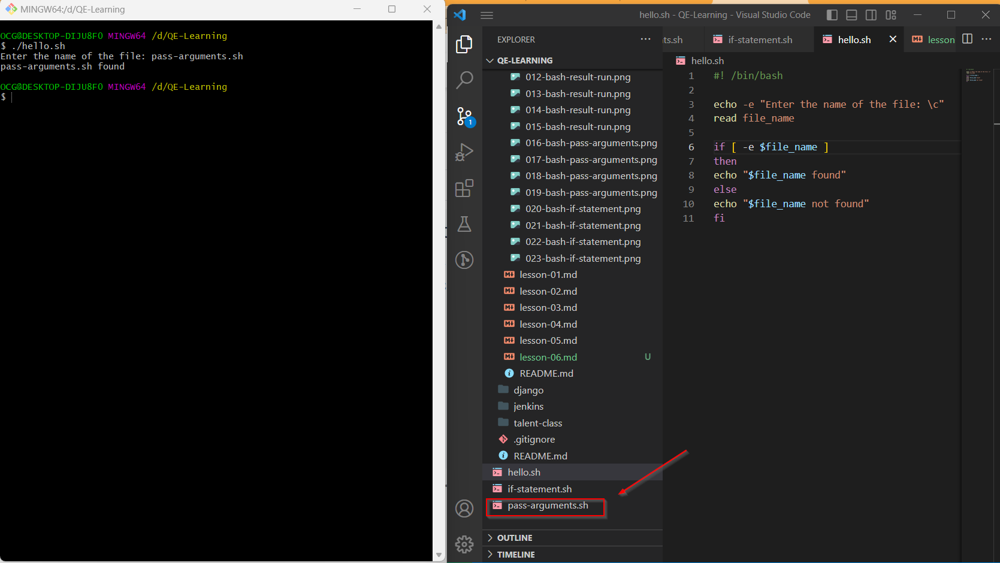
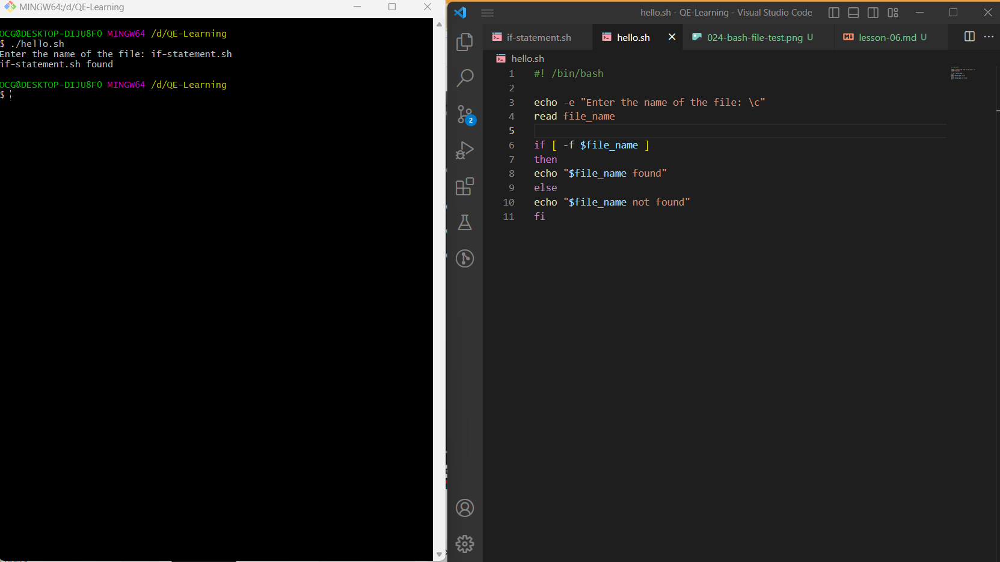
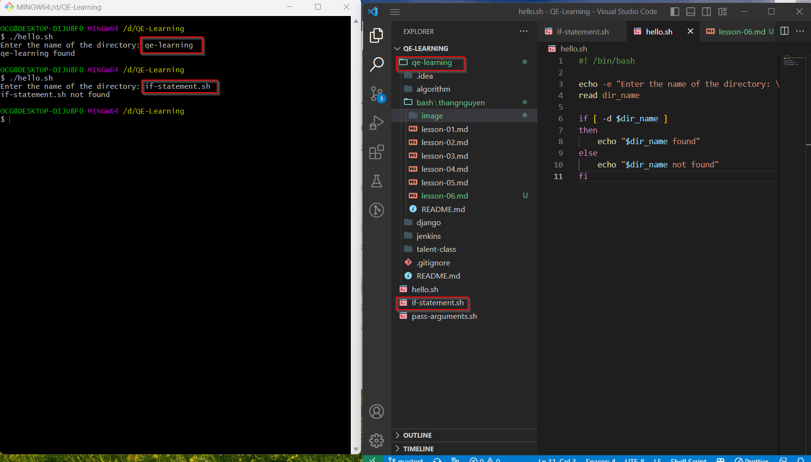

## Lesson 6: File test operators

- Trở lại sau dịp nghỉ lễ dài, hôm nay chúng ta bắt đầu với bài học thứ 6 của series này
- Bài học trước chúng ta đã tìm hiểu về các câu lệnh điều kiện, trong bài học này chúng ta sẽ tìm hiểu về các toán tử kiểm tra file - file test operators

### File test operators

- Kiểm tra file là một trong những công việc thường xuyên trong quá trình viết script
- Có rất nhiều cách để kiểm tra file, trong bài học này chúng ta sẽ tìm hiểu về các toán tử kiểm tra file

#### Toán tử kiểm tra file

- Các toán tử kiểm tra file được sử dụng để kiểm tra các thuộc tính của file

| Toán tử | Ý nghĩa                            |
| ------- | ---------------------------------- |
| -e      | Kiểm tra file có tồn tại hay không |

Ví dụ:

```bash
echo -e "Enter the name of the file: \c"
# \c: không xuống dòng, giữ con trỏ ở cuối dòng
# flag -e: cho phép sử dụng các ký tự đặc biệt: \n, \t, \c ...

read file_name

if [ -e $file_name ]
then
    echo "$file_name found"
else
    echo "$file_name not found"
fi
```

Kết quả:


Chúng ta dùng câu lệnh `read` để nhập tên file từ bàn phím, sau đó chúng ta sử dụng toán tử `-e` để kiểm tra file có tồn tại hay không

- Toán tử `-e` trả về `true` nếu file tồn tại và `false` nếu file không tồn tại

| Toán tử | Ý nghĩa                                        |
| ------- | ---------------------------------------------- |
| -f      | Kiểm tra file có phải là file thường hay không |

Ví dụ:

```bash
echo -e "Enter the name of the file: \c"
read file_name

if [ -f $file_name ]
then
    echo "$file_name found"
else
    echo "$file_name not found"
fi
```

Kết quả:


- Toán tử `-f` trả về `true` nếu file tồn tại và là file thường, `false` nếu file không tồn tại hoặc không phải là file thường
- File thường là file không phải là directory, socket, pipe, ...

| Toán tử | Ý nghĩa                                      |
| ------- | -------------------------------------------- |
| -d      | Kiểm tra file có phải là directory hay không |

Ví dụ:

```bash
echo -e "Enter the name of the directory: \c"
read dir_name

if [ -d $dir_name ]
then
    echo "$dir_name found"
else
    echo "$dir_name not found"
fi
```

Kết quả:


- Toán tử `-d` trả về `true` nếu file tồn tại và là directory, `false` nếu file không tồn tại hoặc không phải là directory

| Toán tử | Ý nghĩa                                               |
| ------- | ----------------------------------------------------- |
| -b      | Kiểm tra file có phải là block special file hay không |

Ví dụ:

```bash
echo -e "Enter the name of the block special file: \c"
read file_name

if [ -b $file_name ]
then
    echo "$file_name found"
else
    echo "$file_name not found"
fi
```

- Toán tử `-b` trả về `true` nếu file tồn tại và là block special file, `false` nếu file không tồn tại hoặc không phải là block special file
- Block special file là file nhị phân, được sử dụng để lưu trữ dữ liệu của thiết bị, chẳng hạn: picture, video, ...

| Toán tử | Ý nghĩa                                                   |
| ------- | --------------------------------------------------------- |
| -c      | Kiểm tra file có phải là character special file hay không |

Ví dụ:

```bash
echo -e "Enter the name of the character special file: \c"
read file_name

if [ -c $file_name ]
then
    echo "$file_name found"
else
    echo "$file_name not found"
fi
```

- Toán tử `-c` trả về `true` nếu file tồn tại và là character special file, `false` nếu file không tồn tại hoặc không phải là character special file

| Toán tử | Ý nghĩa                             |
| ------- | ----------------------------------- |
| -s      | Kiểm tra file có empty là hay không |

Ví dụ:

```bash
echo -e "Enter the name of the file: \c"
read file_name

if [ -s $file_name ]
then
    echo "$file_name not empty"
else
    echo "$file_name empty"
fi
```

- Ngoài ra chúng ta còn có thể sử dụng các toán tứ khác như: `-r`, `-w`, `-x`, ...

- Toán tử `-r` trả về `true` nếu file tồn tại và có quyền đọc
- Toán tử `-w` trả về `true` nếu file tồn tại và có quyền ghi
- Toán tử `-x` trả về `true` nếu file tồn tại và có quyền thực thi
